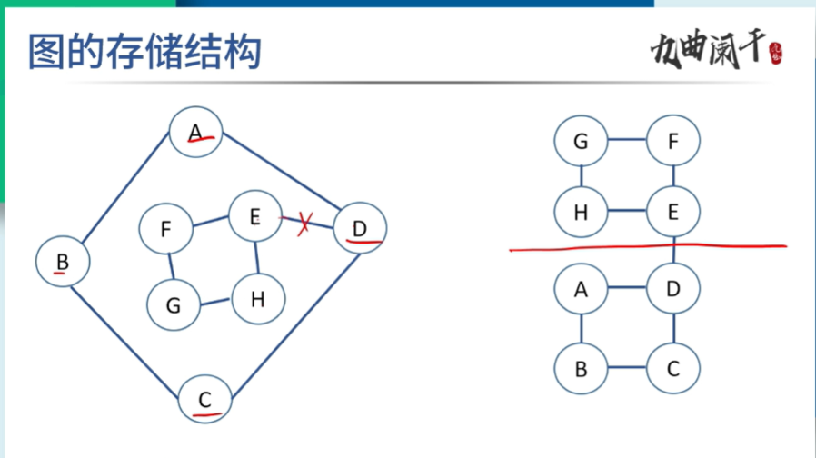

# 图
## 基本概念

## 图的基本概念
图是有顶点的有穷非空集合和顶点之间的边的集合组成的，通常用G(V,E)表示，其中G表示一个图，V是图G中顶点的集合，E是边的集合。
注意图这种数据结构，不允许没有顶点，但边集可以是空。

## 图的概念和分类
1. 有向图   ：无向图和有向图是在表示边的方向，有向图的边集用尖括号<>表示
2. 无向图   ：无向图和有向图是在表示边的方向，无向图的边集用小括号()表示
3. 有向完全图：完全图是具有最多边数的图，对于一个具有n个顶点的有向完全图，边数量的最大值为n(n-1)
4. 无向完全图：完全图是具有最多边数的图，对于一个具有n个顶点的无向完全图，边数量的最大值为n(n-1)/2

## 数据结构中研究的图的性质
1. 必须是简单图（自身不能成环）
2. 不能是多重图（同一条边在图中不能出现两次或两次以上）

## 图的边数量
完全图：具有最多边数的图


| 路径和路径长度 | 路径：从一个顶点开始经过一系列的边到达另外一个顶点形成的顶点序列
路径长度：路径上边的条数
回路：起点和终点相同
简单路径：如果路径中不出现相同的顶点，则称为简单路径
简单回路：除了第一个顶点和最后一个顶点外，其余顶点不重复出现的回路称为简单回路 |
| 度 | 


**无向图的度**指的是，顶点的度指的是与顶点相关联边的数目。无向图不考虑出度和入度。
**有向图的度**分为出度和入度。
入度：在有向图中，对于顶点v，箭头指向v的边的数目
出度：在有向图中，对于顶点v，从该顶点出发的边的出发。 |
| 度和边的关系 | **在无向图中**，所有顶点度之和是边数的两倍
**在有向图中**，所有顶点的出度之和与入度之和相等，与弧的数量也相等。 |
| 子图 | **子图需要满**顶点是原图的子集，边也是原图的子集，这两个条件。 |
| 连通分量


强连通分量 | **连通分量——无向图中的极大连通子图称为连通分量。
强连通分量——有向图中的极大连通子图称为有向图的强连通分量。**

连通分量为子图
子图是要连通的。
连通子图含有极大顶点数。
具有极大顶点数的连通子图包含依附于这些顶点的所有边。 |
| 连通图
强连通图 | **

**强连通图——**
强连通图：在有向图中，对于每一对顶点v和w，从v到w和从w到v都有路径，则称该有向图是强连通图。
有向图中的极大强连通子图称为有向图的强连通分量。 |


| 生成树—— | 生成树：指含有图中全部顶点的极小连通子树 |
包含所有顶点n，但只有足以构成一棵树的n-1条边。 |
| 边的权和网 | 在一个图中，每条边可以标注上一个代表某种含义的数值，该数值称为这个边的权值，例如距离等 网：边上带有权值的图，也称为带权图。 |
|  |  |

## 图的存储结构

1. 邻接矩阵： 
2. 邻接表：一个一维的顶点数组， 一个二维的边数组
3. 十字链表
4. 邻接多重表：

邻接多重表一般是无向图

``` 
ivex : ivex某一条边连接的两个顶点的下标
ilink: ilink指向连接顶点ivex的下一条边
jvex : jvex是某一条边链接的两个顶点的下标
jlink: jlink指向连接顶点jvex的下一条边
```


## 图的存储结构



压缩存储稀疏矩阵的两种存储结构是——三元组表和十字链表 

## 图的遍历

深度优先遍历：
广度优先遍历：广度优先遍历需要借助一个队列，让相邻的节点入队

## 最小生成树
树：如果有n个点，那么一定有n-1条边，树一定没有环树也可以看作一个图，特殊的图。

最小生成树：在图里面求一个树，这个数的边权和最小。


**最小的成本连通所有的节点** |
| Prim算法 | 贪心算法，每次选择权重最小的。 |

# 最短路径

| Dijkstra | 迪杰斯特拉算法运行完毕之后，会形成一个数组，这个数组保存的是$V_{0}$顶点到各个顶点的最短距离， **即单源点到任意一个点的最短距离。** |
| **Floyd**
弗洛伊德算法 | **求顶点之间相互的，所有的最短路径。**

# 拓扑排序与关键路径

| 拓扑排序 | 顶点表示活动，边表示活动之间的优先级。
这样的有向图为顶点表示活动的网，称为AOV网。 |
|  | 拓扑排序的要求是有向无环图 |
|  | 拓扑排序其实就是对于图中所有的顶点，按照先后顺序，排成一个序列。
比如说国外的课程，学完A，才能学B，才能学C。 |
|  | 拓扑排序的步骤
1. 每次选入度为0的点，然后删除这个点和它的出边
2. 继续选入度为0的点，继续这个过程。 |
|  | 拓扑排序排出来的序列可能不唯一。 |
|  | 最短路径 |

## 图的应用


## 邻接矩阵
如果存储的值不表示权重，那么一般存储的值就是0和10表示没有边，1表示有边。
如果存储的值表示权重，那么存储的值就是权重的值。

**邻接矩阵的优点**: 顺序存储方式，查找效率比较高

**邻接矩阵的缺点**：对于邻接矩阵，要存储N个顶点和边的信息，需要N^2个空间，对于空间的消耗比较大, 存储稀疏图的时候，空间的利用率比较低。后面针对于空间的优化，出现了邻接表,


一个问题：不看图的话，如何在邻接矩阵中求指定顶点的度，顶点的入度，顶点的出度


下面是邻接矩阵结构的代码
```
#define max_vertex_num 100

//邻接矩阵
typedef struct Graph {	
	int vex [max_vertex_num];//顶点表
	int edge[max_vertex_num][max_vertex_num];//边表
	int vexnum;		//图的当前顶点数
	int edgenum;	//图的当前边数
	//不表示权重：存储的值为0和1，0表示两个顶点之间没有边，1表示两个顶点之间有边
	//表示权重：  存储的值为两个顶点之间的权重，如果两个顶点之间没有边，则存储的值为无穷
};
```
## 邻接表

这个类似于树的孩子表示法
邻接表

```
typedef struct EdgeNode{
	int val; 边中存储的值
	struct EdgeNode* next;
};

typedef struct Node{
	int val; //顶点值
	struct EdgeNode *first;  //顶点中指向第一条边
};

typedef struct Graph{
	Node node[20]; //顶点数组
	int  vexnum;
	int edgenum;
}
```

## 十字链表-存储有向图


## 邻接多重表-存储无向图

2024年真题第四题，就不用顺着指针去找，直接看图里面存储的标号


2024年第五题，
折半查找

1. 有序静态链表是什么意思
