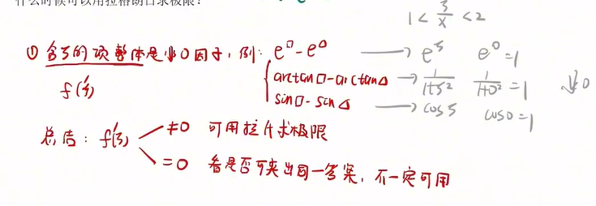
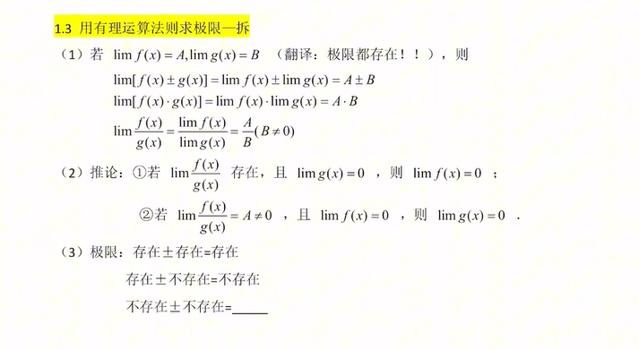
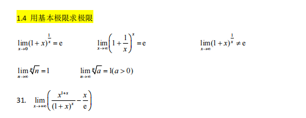
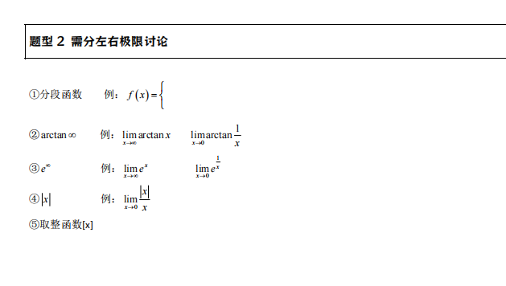

# 函数极限
## 题型1，函数极限基本题型

### 对于$\frac00$型

1. 常规题型
常规题型没有什么好说的，看因子，然后等价和泰勒，泰勒不行再使用洛必达法则。

2. 看见$\sqrt{A} - \sqrt{B}$想到有理化

3. 看见$e^a - e^b提取e^b变成e^b(e^{a-b} - 1)$

4. 看见$ln x \sim x - 1 (x \to 1)$

5. $\lim_{x\to 0^+} x \ln x = 0$
$\ln x$就是一个字，慢

6. 幂指函数取指对数
7. 广义化思想，狗

### 对于$\frac{\infty}{\infty}$型
1. 一般做法：提取无穷大/同除无穷大
2. 快速技巧：抓大头，拿笔划

    当$x \to +\infty, \ln^m x << x^n << \alpha^x(其中m>0, n>0, \alpha>1)$
    当$n->\infty时， \ln^m n << n^p << \alpha^n << n! << n^n(其中m>0, p>0, \alpha>1)$

3. 根式爆破

    $\sqrt{x}$根式爆破，规则：次数一致，再乘根号

    $\ln$爆破
$\infty有时需要区分+\infty和-\infty$, 不是什么都能爆破，往往在$\frac{\infty}{\infty}$

### 类型3————$1^{\infty}$型
没有必要按照七种未定式去做，

1. 用拉格朗日求极限
什么时候可以使用拉格朗日求极限?
e^{\alpha}整体能够是一个非零因子的话，就可以直接使用拉格朗日求极限
例子

### 用有理运算符法则求极限——拆

1.4用基本极限求极限

## 题型2：需要分左右极限讨论

## 题型3：复合函数的泰勒展开

## 题型4：无穷小的阶数

## 题型5：已知某一极限，求另外一个极限/求参数

## 题型6：用夹逼准则求极限——与取整函数相结合

# 专题2：数列极限计算

